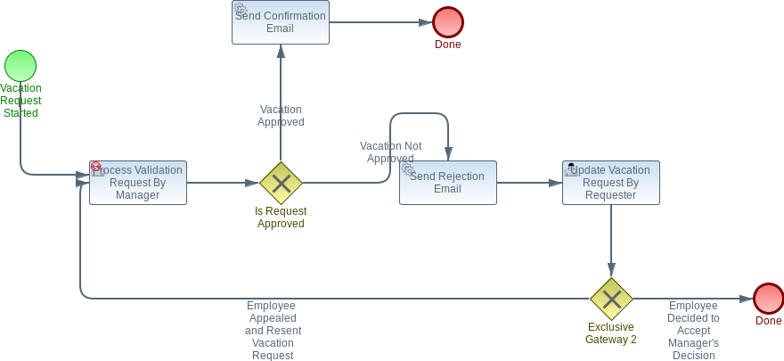

https://documentation.flowable.com/latest/develop/dbs/overview

	at flowabledemo.config.VacationRuleRagConfiguration.vacationRuleVectorStore(VacationRuleRagConfiguration.java:42) ~[classes/:na]

org.springframework.ai.retry.NonTransientAiException: HTTP 404 - {"error":"model \"mxbai-embed-large\" not found, try pulling it first"}

ollama pull mxbai-embed-large

## BPMN:



## How to Test:

Run application and open localhost:8081 to access swagger UI

### Scenario 1: Manager Approved Vacation in First Review

Step 1: create-vacation-request
```
curl -X 'POST' \
  'http://localhost:8081/api/vacation/create-vacation-request' \
  -H 'accept: */*' \
  -H 'Content-Type: application/json' \
  -d '{
  "employeeName": "Ganesh",
  "numberOfDays": 10,
  "vacationPurpose": "Nepal Trekking"
}'
```

Step 2: fetch tasks for group ( MANAGER)
```
curl -X 'GET' \
  'http://localhost:8081/api/vacation/fetch/MANAGER' \
  -H 'accept: */*'

```


Step 3: claim tasks for a MANAGER user (uses task id from Step 2)
```
curl -X 'POST' \
  'http://localhost:8081/api/vacation/claim/1fcbd315-dc71-11ed-83b6-02423debb37c/MGR_BOB' \
  -H 'accept: */*' \
  -d '' 
```

Step 4: /review-vacation-request/{taskId} - approve (uses task id from Step 2)
```
 curl -X 'POST' \
  'http://localhost:8081/api/vacation/review-vacation-request/1fcbd315-dc71-11ed-83b6-02423debb37c' \
  -H 'accept: */*' \
  -H 'Content-Type: application/json' \
  -d '{  "vacationApproved": true }'
```        


### Scenario 2: Manager Approved Vacation in Second Review
    Step 1: create-vacation-request
    Step 2: fetch tasks for group ( MANAGER)
    Step 3: claim tasks for a MANAGER user
    Step 4: /review-vacation-request/{taskId} - deny
    Step 5: fetch tasks for group ( EMPLOYEE)
    Step 6: claim tasks for a that EMPLOYEE user
    Step 7: /update-vacation-request/{taskId}
    Step 8: claim tasks for a MANAGER user
    Step 9: /review-vacation-request/{taskId} - approve 

## Implementation plan

### Phase 0 - MVP - COMPLETED !

    Simple Endpoint to start the vacation request
    
    Endpoint to list user tasks (dummy user to begin with)
    
    Manager  - approve/reject with comment
    
    Employee - appeal or re-request
    
    Mock email job 

### Phase 0.1 - Add E2E tests - COMPLETED !

### Phase 1 - DB to store vacation request and pass around the request id in context

### Phase 2 Security with user roles manager/employee,

### Phase 3  UI Module
